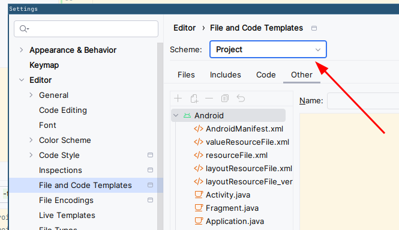
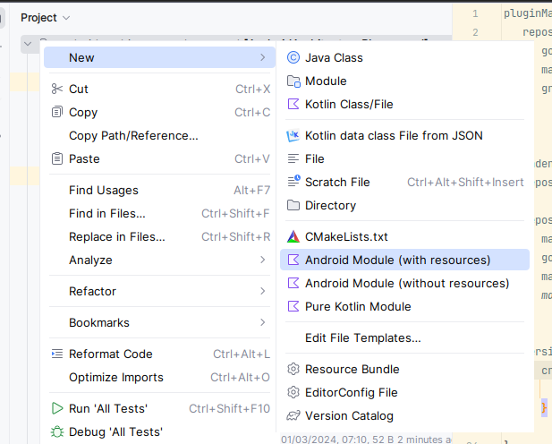

# Contributing

To contribute to this project:

1. Install [Git LFS](https://git-lfs.com/)
2. Checkout `main`
3. Pull submodules `git submodule update --init --recursive`
4. Run `git lfs fetch` in the repo
5. Create a new branch for your contribution
6. Commit your work. While commiting, use [conventional commits](https://www.conventionalcommits.org/en/v1.0.0/). Scope tag should
   be the name of the module you are updating.
7. Try to avoid breaking changes, but if they cannot be avoided, you must put `BREAKING CHANGE` in the footer of the commit
   mesasage
   and explain the change.
8. Create a merge request
9. After your PR is merged, new release will be generated automatically every day

## Updating versions

We are using [Mend Renovate](https://github.com/renovatebot/renovate) to automatically update
dependencies in this project. It will periodically create PRs for dependency updates.

To [reduce supply chain attack surface](https://blog.yossarian.net/2025/11/21/We-should-all-be-using-dependency-cooldowns),
we are using dependency cooldowns in renovate. However, this does not work for all dependencies: If a PR is open with Age
stating "Unknown", DO NOT MERGE until the PR is at least 7 days old. This ensures that we honor dependency cooldowns even when
release date is not available.

## Running tests / detekt efficiently

To run all debug and non-Android tests, you can run `./gradlew runDebugTests`.

To run all debug and non-Android detekt checks, you can run `./gradlew runDebugDetekt`.

## Creating a new module

To easily add new modules, first enable project templates (you only need to do this once).
Open Android Studio's Settings, go to "File and Code Templates" and set Scheme to "Project".



Then, to create a new module:

1. Right click on the root in the project window, select New and then the project type you want
   
2. Add module to `settings.gradle.kts`
3. Add module to app's `build.gradle.kts` as `implementation(projects.newModule)`)
4. Remove leading space from all generated ` .gitignore` files (workaround for the https://youtrack.jetbrains.com/issue/IJPL-2568)

## Hierarchy of the feature modules

Every feature should contain following modules:

* `feature-name`
    * `data` - data module with all non-UI logic (such as repositories).
      No other `data` or `ui` module should depend on this (except for tests).
    * `api` - interfaces and data models exposed to other modules.
      This module should generally contain no logic to speed up builds.
      It can also contain `testFixtures` source set for faking interfaces exposed in that module.
    * `ui` - Module containing feature's ui (Screens / Fragments / ViewModels).
      No other `data` or `ui` module should depend on this (except for tests).

If your module contains instrumented tests, you must enable them with the following call:

```kotlin
custom {
   enableEmulatorTests.set(true)
}
```

## Running integration tests

`./gradlew :app:connectedAndroidTest -PtestAppWithProguard`

# Creating screenshot tests

To create screenshot tests for your compose screen:

1. Make the preview functions public
2. Add `showkase` plugin to the module of the screen you want to test
3. Add `@ShowkaseComposable(group = "Test")` annotation to the preview of the screen you want to test
    * If you want to create an animated screenshot, you can add an `animated` tag:
      `@ShowkaseComposable(group = "Test", tags = ["animated"])`
    * If you want to control the duration of the recorded animation you can add `duration-[MS]` tag, for example `duration-2000`
      will record for 2 000 milliseconds.
4. Run `./gradlew recordPaparazziDebug`

# Updating screenshot tests

To update screenshot tests:

1. Run `./gradlew recordPaparazziDebug`
