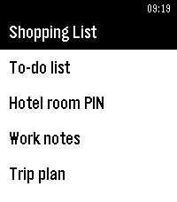
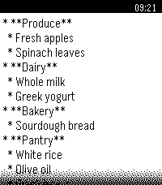

# Text Sync for Pebble

An app for syncing and displaying your text/markdown files on the watch

 

# Install

**Note: the old Pebble app is not supported. You have to use either the microPebble or the new Pebble/Core app.**

WIP

# Features

#### Text Display
Select a bunch of text files on the phone. Now you can read them on your watch.

#### Faaast
Files are synced to the watch, which means that they open instantly. No need to wait for the phone connection

#### Offline
Since files are synced, they are always available, even without the phone nearby

#### Easy sync
After you change your text files, just pull to refresh on the phone's list and changes will be refreshed to the watch

#### Tasker integration
Sync automatically in the background via [Tasker](https://tasker.joaoapps.com/) automation tool.

# Usage

## On the watch

### Buttons

On the text screen:

* Single click / hold DOWN - Scroll text down
* Single click / hold UP - Scroll text up

## On the phone

### Adding files

To add a new file to syncing, simply press the + button on the landing page of the app and select your file.

Note: you must select the file from its actual place on the storage. Selecting it from "Recents" will not work.

### Slots

The watch can only store a limited amount of text. This app represents that amount with "slots".

One slot is equal to approximately 250 characters of text. Each watch can store:

* Core watches with relatively recent firmware - 255 slots
* Classic watches - 15 slots
  
Text Sync will only transfer first X slots to the watch. For example, if your watch can store 15 slots and you have 1 large text file that takes up 14 slots, another that takes up 2 slots and another that takes up 1 slot,
Text Sync will only sync the first file and the half of the second file. Third one will not be synced.

You can use "Max slots" slider in the details of every file to trim the file length, so that it will only take up a specified number of slots.

# Contributing

See [CONTRIBUTING](CONTRIBUTING.MD)
